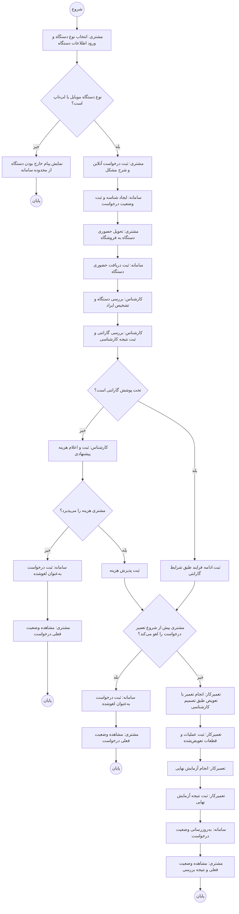

```mermaid
flowchart TD
    start((شروع)) --> A[مشتری: انتخاب نوع دستگاه و ورود اطلاعات دستگاه]
    A --> B{نوع دستگاه موبایل یا لپ‌تاپ است؟}
    B -- خیر --> C[نمایش پیام خارج بودن دستگاه از محدوده سامانه]
    C --> end1((پایان))
    B -- بله --> D[مشتری: ثبت درخواست آنلاین و شرح مشکل]
    D --> E[سامانه: ایجاد شناسه و ثبت وضعیت درخواست]
    E --> F[مشتری: تحویل حضوری دستگاه به فروشگاه]
    F --> G[سامانه: ثبت دریافت حضوری دستگاه]
    G --> H[کارشناس: بررسی دستگاه و تشخیص ایراد]
    H --> I[کارشناس: بررسی گارانتی و ثبت نتیجه کارشناسی]
    I --> J{تحت پوشش گارانتی است؟}

    J -- بله --> K[ثبت ادامه فرایند طبق شرایط گارانتی]
    J -- خیر --> L[کارشناس: ثبت و اعلام هزینه پیشنهادی]
    L --> M{مشتری هزینه را می‌پذیرد؟}
    M -- خیر --> N[سامانه: ثبت درخواست به‌عنوان لغوشده]
    N --> O[مشتری: مشاهده وضعیت فعلی درخواست]
    O --> end2((پایان))
    M -- بله --> P[ثبت پذیرش هزینه]

    K --> Q{مشتری پیش از شروع تعمیر درخواست را لغو می‌کند؟}
    P --> Q
    Q -- بله --> R[سامانه: ثبت درخواست به‌عنوان لغوشده]
    R --> S[مشتری: مشاهده وضعیت فعلی درخواست]
    S --> end3((پایان))
    Q -- خیر --> T[تعمیرکار: انجام تعمیر یا تعویض طبق تصمیم کارشناسی]
    T --> U[تعمیرکار: ثبت عملیات و قطعات تعویض‌شده]
    U --> V[تعمیرکار: انجام آزمایش نهایی]
    V --> W[تعمیرکار: ثبت نتیجه آزمایش نهایی]
    W --> X[سامانه: به‌روزرسانی وضعیت درخواست]
    X --> Y[مشتری: مشاهده وضعیت فعلی و نتیجه بررسی]
    Y --> end4((پایان))
```